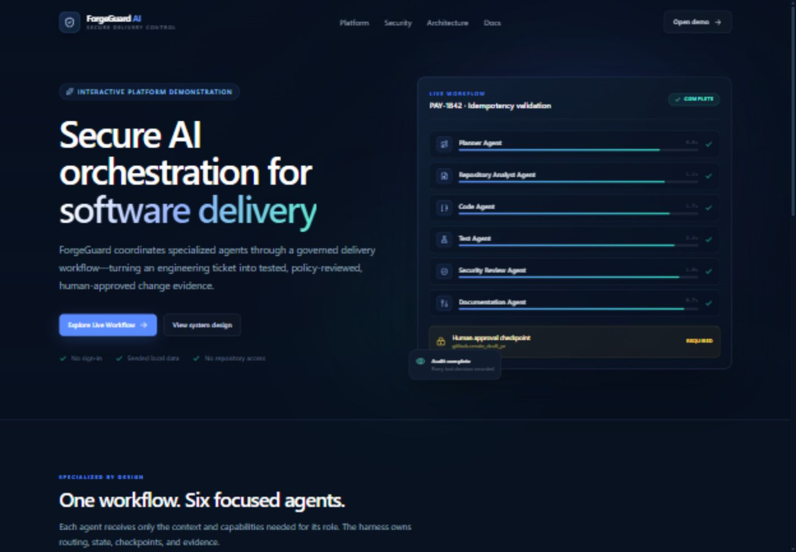
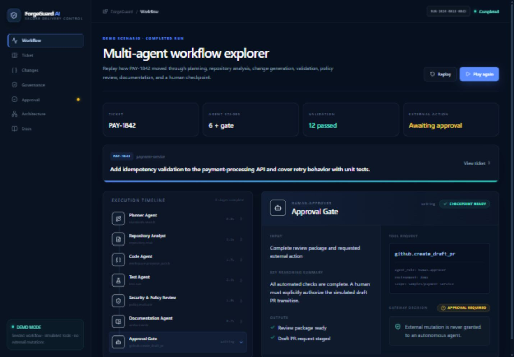
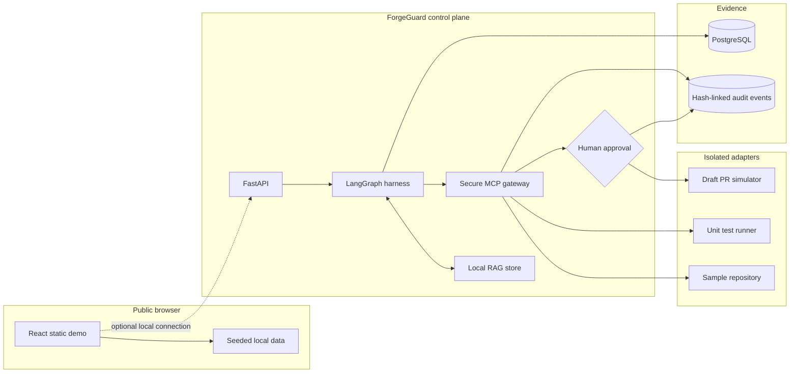

# ForgeGuard AI

## Enterprise Multi-Agent SDLC Automation Platform

ForgeGuard AI is a portfolio demonstration of a secure agentic harness that moves a realistic engineering ticket through planning, repository analysis, proposed code changes, validation, security review, human approval, and simulated draft pull-request generation.

The public experience is intentionally recruiter-friendly: submit a local-only engineering ticket or open the completed reference scenario, replay the workflow, inspect every tool decision, and approve a simulated draft PR artifact—without signing in, entering a key, or connecting a repository.





> The screenshot above is generated from the local application during release verification.

## Why this project

Agentic development systems need more than capable agents. They need explicit identity, narrow tool permissions, deterministic checkpoints, reviewable evidence, and a human authority boundary for external actions. ForgeGuard demonstrates those controls as a cohesive product rather than a disconnected set of scripts.

### Key features

- Nine-route React and TypeScript experience with a complete static demo data layer.
- Local-only custom ticket intake with deterministic planning, validation, policy, and approval outputs.
- Step-by-step replay of six agent stages and a human approval checkpoint.
- Deterministic LangGraph workflow that requires no model provider.
- FastAPI resources for tickets, workflow runs, policy decisions, approvals, and audit evidence.
- Local retrieval over seeded engineering standards, security policy, and service guidance.
- MCP-style tool gateway with typed arguments, deny-by-default authorization, least privilege, and approval gates.
- SQLAlchemy domain model backed by PostgreSQL in Docker Compose.
- Reviewable Spring Boot payment-service sample with a unified diff and JUnit tests.
- Pytest policy/API coverage, Vitest component coverage, and GitHub Actions verification.
- GitHub Pages workflow that publishes the backend-independent static experience.

## Demo scenario

**PAY-1842 — Add idempotency validation to the payment-processing API and cover retry behavior with unit tests.**

The proposed change requires an `Idempotency-Key`, binds it to a canonical request fingerprint, returns the original result for an equivalent retry, rejects conflicting reuse with HTTP 409, and proves that the payment processor is invoked once per logical request.

The sample repository is under [`samples/payment-service`](samples/payment-service). Its checked-in source represents the reviewable proposed end state; [`proposed-change.diff`](samples/payment-service/proposed-change.diff) preserves the unified diff shown in the application.

Visitors can also open **New ticket** and supply their own summary, context, service, risk, and acceptance criteria. Custom ticket text remains in browser storage and produces a deterministic structured proposal. Because no repository is connected, ForgeGuard labels repository-specific assumptions instead of inventing a source-code diff.

## Architecture



The static site and local service deliberately share the same scenario contract. GitHub Pages renders the entire public workflow from bundled typed data. Docker Compose adds the executable API, database, LangGraph orchestration, and gateway for local technical evaluation.

See [`docs/ARCHITECTURE.md`](docs/ARCHITECTURE.md) for component responsibilities, trust boundaries, state transitions, and deployment profiles.

## Agent workflow

| Stage | Responsibility | Scoped capability | Evidence |
|---|---|---|---|
| Planner | Normalize intent and build an ordered plan | `standards.search` | Plan, risk classification |
| Repository Analyst | Map files, dependencies, and conventions | `repository.read` | Impacted file set |
| Code | Produce a review-only patch | `workspace.propose_patch` | Unified diff, rationale |
| Test | Validate acceptance criteria safely | `test.run` | Test report, retry invariants |
| Security & Policy Review | Evaluate risk and capability history | `policy.evaluate` | Findings, approval decision |
| Documentation | Assemble the review package | `artifact.write` | PR title, body, checklist |
| Human Approval | Authorize the final simulated transition | `github.create_draft_pr` | Approval and draft artifact |

`DeterministicWorkflow` compiles these stages as a LangGraph state graph. Its outputs are stable, inspectable, and independent of an external model. `ProviderInterface` is an intentionally unconfigured extension point for later experimentation.

## Secure MCP Tool Gateway

Agents never receive an adapter directly. Every request carries an agent identity, role, tool name, environment, structured arguments, and correlation ID. The gateway processes it in this order:

1. Parse the request with Pydantic and reject unknown fields.
2. Validate tool-specific arguments, bounds, and repository paths.
3. Apply unconditional blocks for production deployment and secret retrieval.
4. Evaluate the role-to-tool permission matrix using deny-by-default behavior.
5. Return `allowed`, `approval_required`, or `blocked`.
6. Append a hash-linked audit event before any permitted simulated adapter runs.

Representative policy outcomes:

| Tool | Result | Reason |
|---|---|---|
| `repository.read` | Allowed | Analyst role, read-only operation, approved sample scope |
| `test.run` | Allowed | Validator role, unit suite, bounded timeout |
| `github.create_draft_pr` | Approval required | Represents an external state change |
| `deployment.production` | Blocked | Prohibited in every demo role and environment |
| `secrets.read` | Blocked | No role grant and no registered adapter |

See [`docs/THREAT_MODEL.md`](docs/THREAT_MODEL.md) for abuse cases and residual risks.

## Repository structure

```text
apps/
  web/                    React, TypeScript, Vite, Tailwind
  api/                    FastAPI, LangGraph, SQLAlchemy, gateway
samples/payment-service/  Self-contained Spring Boot-style sample
docs/                     Architecture, threat model, API, demo, decisions
infra/                    Local infrastructure notes
.github/workflows/        CI and GitHub Pages deployment
docker-compose.yml        PostgreSQL + API + static web
```

## Local setup

### Docker Compose

Requirements: Docker Engine with Compose v2.

```bash
cp .env.example .env
docker compose up --build
```

- Web experience: `http://localhost:8080`
- API documentation: `http://localhost:8000/docs`
- API health: `http://localhost:8000/api/v1/health`

Stop the stack with `docker compose down`. Add `-v` only when you intentionally want to remove the local PostgreSQL volume.

### Native development

Requirements: Node.js 22+, Python 3.11+, and npm.

```bash
npm install --prefix apps/web
npm run dev --prefix apps/web
```

In another terminal:

```bash
python -m venv .venv
# Windows: .venv\Scripts\activate
# macOS/Linux: source .venv/bin/activate
pip install -r apps/api/requirements-dev.txt
cd apps/api
uvicorn forgeguard.main:app --reload
```

Without `DATABASE_URL`, the API uses a local SQLite database for convenient development. Docker Compose configures PostgreSQL automatically. More detail is in [`docs/LOCAL_SETUP.md`](docs/LOCAL_SETUP.md).

## Testing

```bash
# Frontend
npm run typecheck --prefix apps/web
npm run lint --prefix apps/web
npm test --prefix apps/web
npm run build --prefix apps/web

# Backend
cd apps/api
ruff check forgeguard tests
pytest --cov=forgeguard --cov-report=term-missing

# Sample Java service (optional local validation)
cd samples/payment-service
mvn test
```

The full strategy and test boundaries are documented in [`docs/TESTING.md`](docs/TESTING.md).

## API overview

| Method | Path | Description |
|---|---|---|
| `GET` | `/api/v1/health` | Service mode and version |
| `GET` | `/api/v1/tickets/PAY-1842` | Seeded ticket and retrieved context |
| `GET` | `/api/v1/workflows/demo` | Persisted completed workflow |
| `POST` | `/api/v1/workflows/demo/run` | Execute the deterministic graph |
| `GET` | `/api/v1/governance/decisions` | Seeded and runtime policy evidence |
| `POST` | `/api/v1/governance/evaluate` | Validate and evaluate a tool request |
| `GET` | `/api/v1/approvals/APV-0042` | Final review package |
| `POST` | `/api/v1/approvals/APV-0042/approve` | Record approval and return a simulated PR artifact |

Full request and response examples are in [`docs/API.md`](docs/API.md). Interactive OpenAPI documentation is available at `/docs` when the local API is running.

## Demo walkthrough

1. Start at the landing page to understand the product boundary and control-plane model.
2. Open **New ticket**, enter a safe engineering scenario, and run the deterministic workflow—or use PAY-1842 as the reference path.
3. Replay the agent timeline one stage at a time.
4. Inspect **Ticket** for normalized criteria and locally retrieved standards.
5. Review **Changes** for an honest structured proposal or the reference Java diff.
6. Use **Governance** to expand allowed, approval-required, and blocked tool decisions.
7. Open **Approval**, review the package, and select **Approve Draft PR**.
8. Confirm that the resulting draft is explicitly simulated and includes a local audit record.
9. Finish in **Architecture** to trace data flow and trust boundaries.

See [`docs/DEMO_WALKTHROUGH.md`](docs/DEMO_WALKTHROUGH.md) for a guided evaluation script.

## GitHub Pages deployment

The `pages.yml` workflow builds `apps/web` with the repository-specific base path and deploys only the static output. In repository settings:

1. Open **Settings → Pages**.
2. Set **Source** to **GitHub Actions**.
3. Push the `main` branch or run **Deploy public demo to Pages** manually.

The static bundle contains the complete reference scenario and does not require the API, database, or credentials. Browser storage is used only to persist a visitor's local custom ticket and approval state; the reference demo still works when storage is unavailable. The included `404.html` restores client-side routes when a visitor opens a nested path directly.

## Scope and safety

ForgeGuard AI is a public portfolio demonstration, not a production service.

- GitHub, CI/CD, deployment, payment processing, and secret access are simulated.
- The site never asks for credentials, tokens, repository authorization, or account connection.
- No adapter can mutate an external repository, trigger a deployment, or retrieve a secret.
- The approval button changes local demo state and returns a simulated artifact only.
- Custom ticket text stays in the visitor's browser and is never sent to the API, a model provider, or a repository.
- The in-memory idempotency store in the sample is educational; it is not a production concurrency or durability design.
- Security controls shown here demonstrate architecture and policy behavior, not certification or compliance status.

Design rationale and tradeoffs are recorded in [`docs/DECISIONS.md`](docs/DECISIONS.md).
