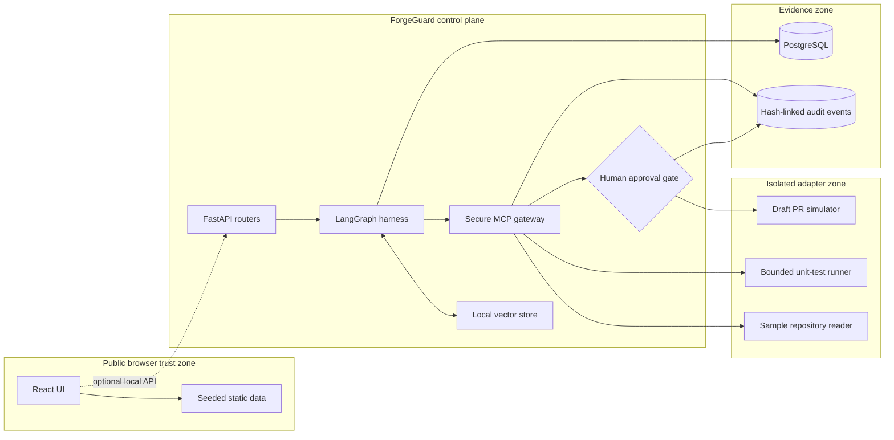
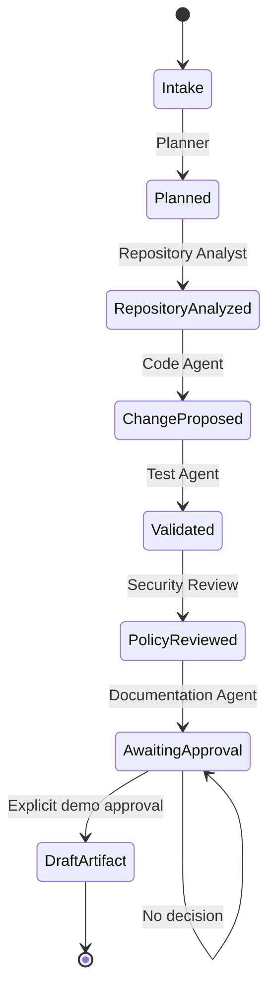

# Architecture

## Purpose

ForgeGuard demonstrates how a multi-agent software delivery harness can separate reasoning from capability. The design treats agent output as untrusted proposals, places policy enforcement in a central gateway, and makes human authority explicit at the point where a workflow would otherwise change an external system.

## Deployment profiles

### Static public profile

The Vite build contains all routes, four typed ready-made ticket scenarios, deterministic custom-ticket generators, the reference code diff, policy events, and the approval interaction. GitHub Pages serves this immutable bundle. It has no required API connection, sign-in, key, or writable backend. Ready-made scenarios require no visitor data; optional visitor-supplied tickets and approvals are persisted only in browser storage and treated as untrusted display input.

### Local evaluation profile

Docker Compose starts an Nginx web container, FastAPI service, and PostgreSQL. The API seeds the same scenario into relational entities and exposes deterministic workflow, retrieval, policy, and approval operations.

## Component responsibilities

### React web application

- Renders recruiter-facing product context and the complete evidence chain.
- Maintains only transient replay and approval state.
- Works without the API and never stores credentials.
- Uses BrowserRouter with a Pages-compatible `404.html` route restoration script.

### FastAPI service

- Exposes versioned REST resources and OpenAPI documentation.
- Owns request parsing, dependency injection, startup seeding, and response contracts.
- Allows CORS only from configured local origins.

### LangGraph harness

- Routes planner, analyst, code, test, security, and documentation stages.
- Stores explicit stage state and deterministic execution evidence.
- Stops at `awaiting_human_approval`; it never creates an external PR.
- Provides an unconfigured provider interface for later experimentation.

### Local retrieval store

- Seeds engineering standards, security guidance, service conventions, and tool policy.
- Tokenizes documents into sparse local vectors and ranks them with cosine similarity.
- Returns source, text, and score for transparent context inspection.

### Secure MCP Tool Gateway

- Accepts identity, role, tool, environment, arguments, and a correlation ID.
- Validates tool-specific Pydantic schemas before authorization.
- Applies unconditional blocks before the role permission matrix.
- Treats unlisted capabilities as denied.
- Emits one of `allowed`, `approval_required`, or `blocked`.

### Persistence and audit

SQLAlchemy defines tickets, workflow runs, agent executions, policy decisions, approval requests, and audit events. Audit events include the prior event hash and a hash over canonical content. This makes accidental mutation evident; it is not presented as an external notarization system.

## Workflow state

## Trust boundaries

1. **Browser to API:** optional local requests contain demo identifiers and structured payloads only. The public site does not depend on this boundary.
2. **Harness to gateway:** agent text cannot invoke a tool. A separate typed request carries authenticated role and requested capability.
3. **Gateway to adapter:** the gateway is the only invocation path. A policy result must precede adapter execution.
4. **Approval gate to state change:** only a human decision can authorize the draft-PR transition; in this project the adapter still produces a local artifact.
5. **Control plane to evidence:** audit payloads record decisions and identifiers while excluding secret values.

## Failure behavior

- Unknown tool: blocked by default.
- Invalid arguments: HTTP 422; no adapter invocation.
- Disallowed role/tool pair: blocked and audited.
- High-risk tool: blocked regardless of role.
- Approval-required tool: paused until the exact review package is approved.
- Database unavailable: static website remains functional; local API reports unhealthy.
- Retrieval yields weak matches: records remain inspectable with explicit scores.

## Extension points

- Replace `LocalVectorStore` with another local vector backend behind the same retrieval shape.
- Add a provider implementation without changing the deterministic public profile.
- Add simulated adapters only after defining schemas and policy entries.
- Replace the sample in-memory idempotency store independently of the ForgeGuard platform.
